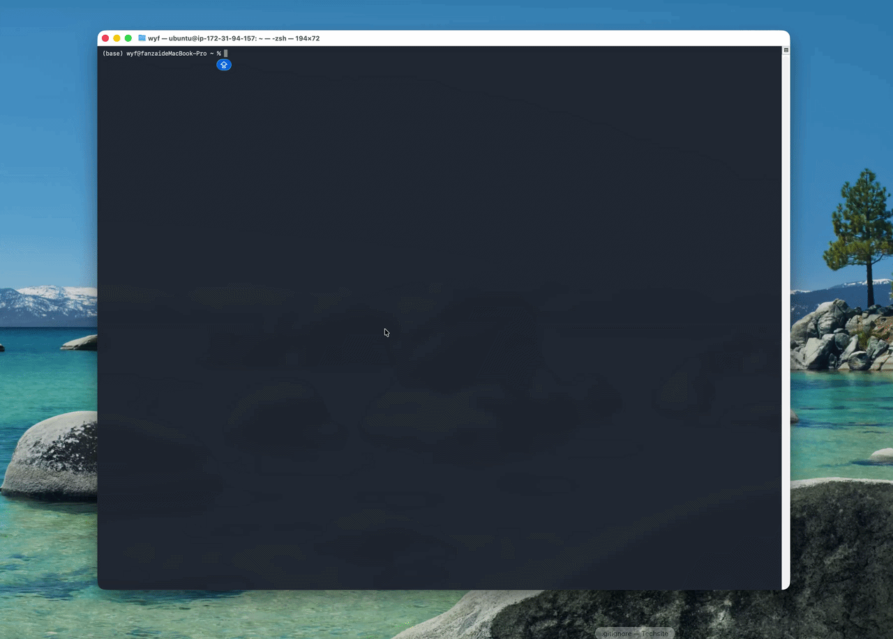

# 💻 TermFolio

> **A fully functional, retro-hacker terminal portfolio powered by React and Ink.**


## 📸 Preview




## ✨ Features

* **🖼️ Automated Braille ASCII Portrait:** Includes a custom image processing pipeline (`generate-portrait.ts`) powered by Sharp. It automatically crops, grayscale-converts, dithers, and maps a standard JPG into high-density 2x4 Braille ASCII art.
* **⌨️ Immersive TUI (Terminal User Interface):** Full keyboard navigation. Users can seamlessly explore the 'About', 'Experience', and 'Links' tabs using Arrow keys or the `Tab` / `Shift+Tab` keys.
* **⏱️ Seamless Typewriter Effects:** Retro "typewriter" text rendering with strict React state management to ensure multi-paragraph text flows perfectly with zero-delay transitions.
* **✨ Authentic Terminal Aesthetics:** Features classic blinking terminal cursors (`►`) and dynamic color highlighting that responds instantly to user keystrokes.
* **🌐 Cross-Platform Links:** Pressing 'Enter' on the Links page automatically opens URLs or emails in the user's native host browser (Mac/Windows/Linux).

## 🚀 Quick Start

Drop into the matrix in seconds.

```bash
# Clone the repository
git clone https://github.com/yourusername/termfolio.git

# Navigate into the project directory
cd termfolio

# Install dependencies
npm install

# Run the development environment
npm run dev
```

## 🛠️ Customization Guide

Make this portfolio your own! TermFolio is designed to be easily configurable.

### 1. Generate Your Own ASCII Portrait
Say goodbye to manual ASCII generators. TermFolio includes an automated script:
1. Place a square photo of yourself at `input/portrait.jpg` (or your chosen path).
2. Run the processing script:
   ```bash
   npm run generate:portrait
   ```
3. The script will automatically parse your image and update `src/assets/portrait.ts` with your custom Braille ASCII art.

### 2. Update Your Content
Modify the text and details to fit your profile.
- **Bio/About**: Edit `src/pages/About.tsx`
- **Work History**: Edit `src/pages/Experience.tsx`
- **Social Links**: Edit `src/pages/Links.tsx`

## 📜 License

This project is open-source and available under the [MIT License](LICENSE).
